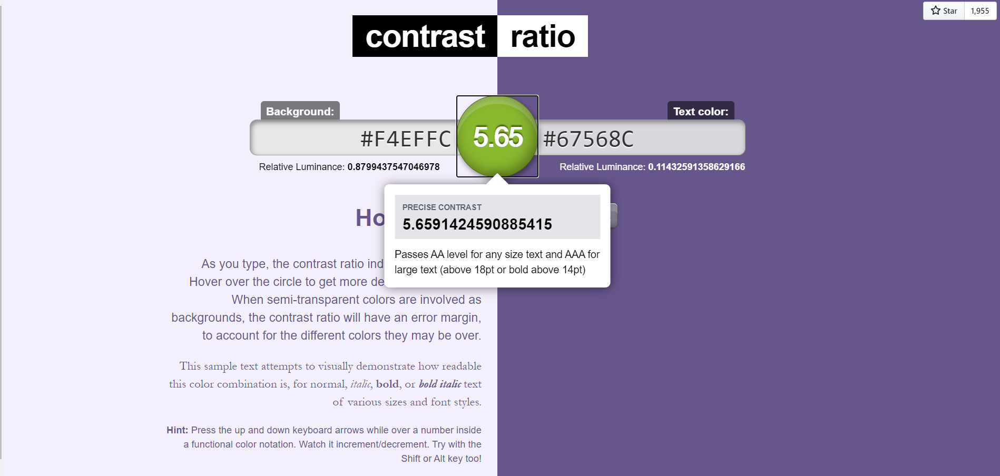

# Assignment-07
## Description
The main purpose of this design was simplicity and creating a certain mood that would create the intended effect on the user. Since journaling should be a calming and positive activity done normally at night, shades of blue and purple were used. It should be noted that any and all unnecessary features are removed in order to create a simplified process as well as replicate the inspiration of a manual journal. Thus, the two focuses for the design were keeping only necessary features and having a pleasant color that would keep the user comfortable. 
## Design
Link to design: https://www.figma.com/file/xhJP5K7QEr330aLit9wzji/DH-150-Prototype?node-id=0%3A1

Link to prototype: https://www.figma.com/proto/xhJP5K7QEr330aLit9wzji/DH-150-Prototype?node-id=55%3A157&scaling=min-zoom
## Impression Test + Cognitive Walkthrough
Link to impression test + cognitive walkthrough: https://docs.google.com/document/d/1nTvRY_yRavqG4yvciU_bMdBOEdjuI6NpsCNzGFGlwNw/edit

Summary of findings: Overall, feedback was positive and the few suggestions have been incorporated in the revisions section below. My goal of a simple interface seemed to be achieved. The main suggestions were regarding a few simple fixes that would help the user fix their errors and navigate easier. Since the design is already extremely simplistic, these suggestions were very helpful as any functional fixes would be very impactful. 
## Revisions
A note of a few of the revisions made after the impression test and cognitive walkthrough: the addition of the home button to each screen during the creation of the journal in order to minimize steps to return home, addition of a slider bar to accomodate for half hours of sleep (ie: 7hr30 of sleep), creation of registering task in order to set personalization and goals. 
## Accessibility Test

## Reflection
This process went very smoothly and the actual act of creating a high fidelity prototype helped clarify what was important to the app. For example, a previous task I had in mind was creating habits to track but through creating a high fidelity prototype, realized that this task was not as vital, useful, or coherent with the rest of the app. As a result, I replaced it with a more personalized registration task in order to give the feel of a manual journal with the ease and personalization of digitalization. Receiving feedback from others was also a very positive process. All feedback was helpful and the resulting revisions made were both easy and impactful. 
